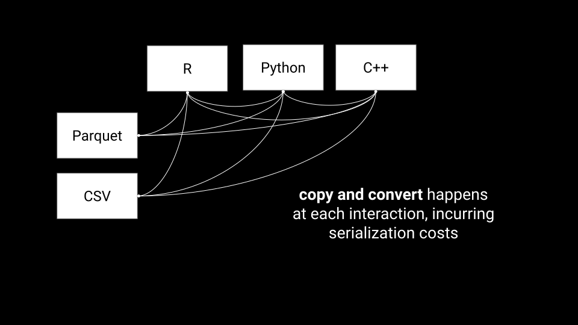
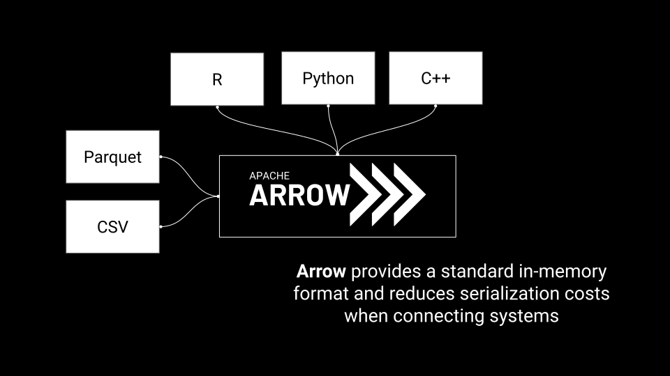
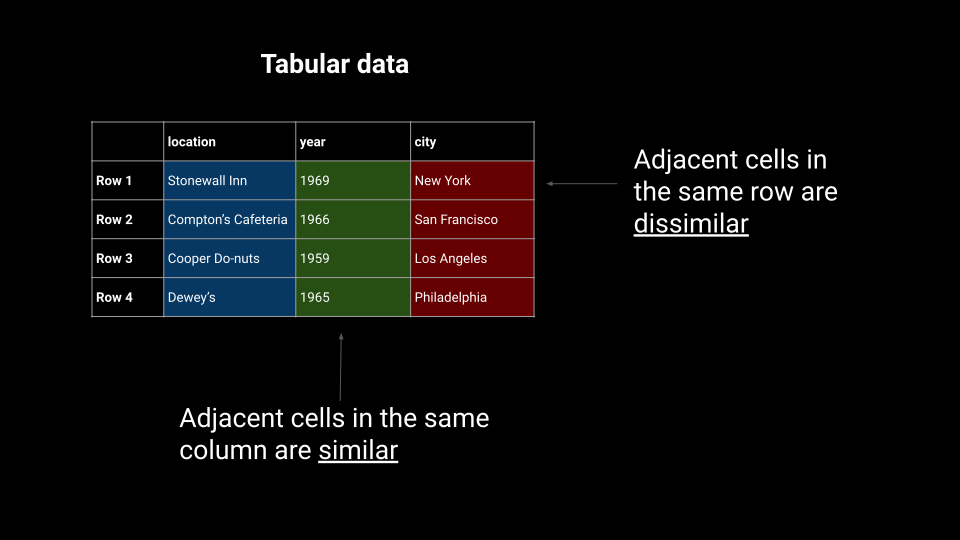
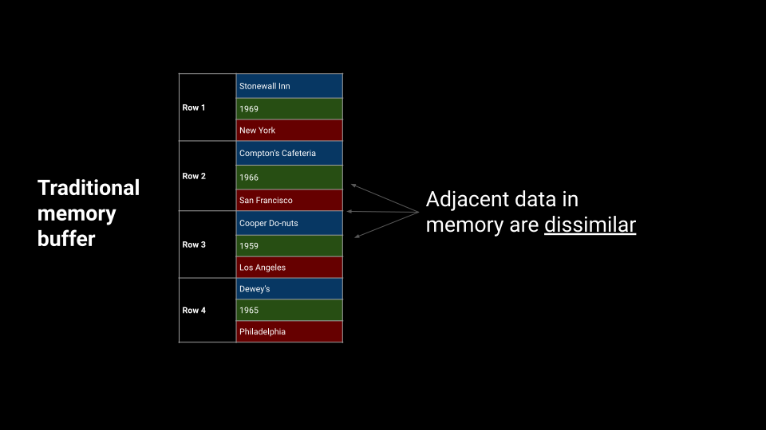
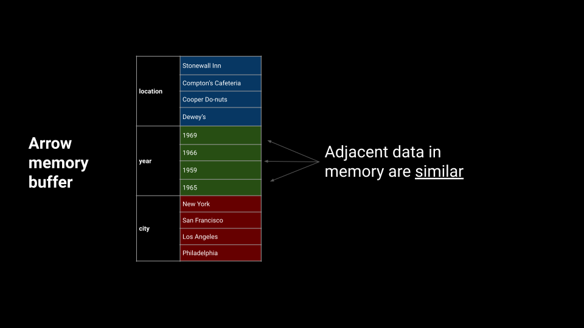
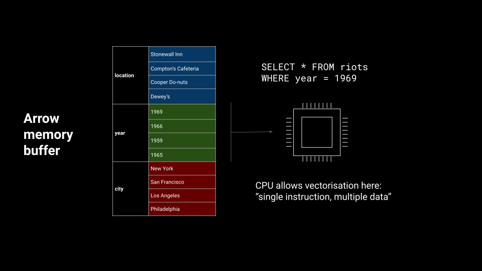
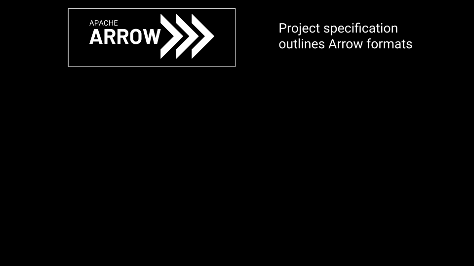
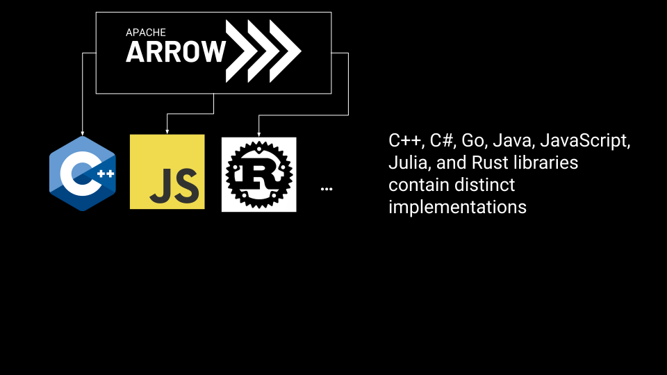
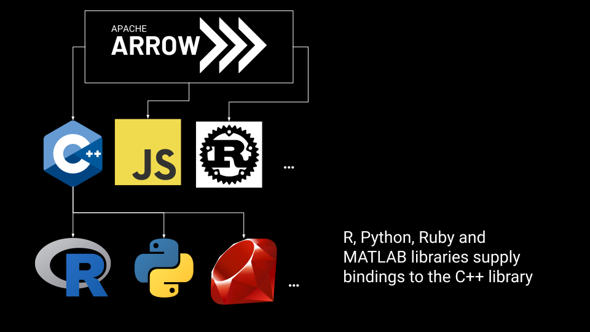
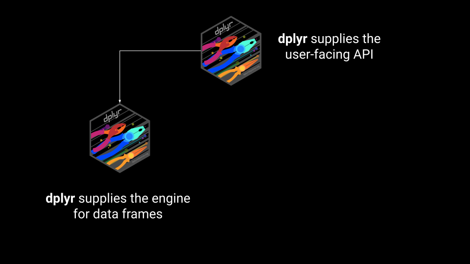

```{r load-packages, message=FALSE, echo=FALSE}
library(xaringanthemer)
library(tidyverse)
library(flair)
library(metathis)
library(arrow)
```


```{r meta, echo=FALSE}
# This is used to create all the social media tags etc. If you don't have a 
# good social preview image of your own, there's a generic one that you can use
# in this repo. Just substitute this:
#
#   image = "https://djnavarro.net/xaringan-template-voltrondata/img/social-media-preview.png",
#
# It won't show anything specific to your slides but it will show the Voltron 
# Data logo and data lake image against the usual dark green background

meta() %>%
  meta_name("github-repo" = "djnavarro/slides-data-thread-2022") %>% 
  meta_social(
    title = "Doing more with data: An introduction to Arrow for R users",
    description = "An example slide deck using the Voltron Data template for xaringan",
    url = "https://djnavarro.net/xaringan-template-voltrondata",
    image = "https://djnavarro.net/xaringan-template-voltrondata/img/title-slide-image.png",
    image_alt = "Image showing the title slide. The title in white reads 'Voltron Data template for xaringan users', with 'by Danielle Navarro' immediately underneath. The background is dark green, with the Voltron Data 'data lake' image shown in light green below the title, and the company logo shown in light green in the top right corner",
    og_type = "website",
    og_author = "Danielle Navarro",
    twitter_card_type = "summary_large_image",
    twitter_creator = "@djnavarro"
  )
```


```{r child = "style/slide-setup.Rmd"}
# Much of the set up work defining the theme is done in slide-setup.Rmd
```


class: title-slide, theme-green-maximal  <!-- title slide style -->


.center[.large[.boldface[Doing more with data: An introduction to Arrow for R users]]]  <!-- title, one line -->

.center[.midi[by Danielle Navarro]] <!-- author, one line -->
.center[.midi[[djnavarro.net/slides-data-thread-2022](http://djnavarro.net/slides-data-thread-2022)]] <!-- general info, one line -->

<!--
font-size classes (relative to normal 100%)

.larger = 200% 
.large  = 130% 
.midi   = 85% 
.small  = 70% 
.xsmall = 60% 
.tiny   = 50% 
-->


<!----------------------------- SLIDE BREAK ----------------------------->
---

class: theme-green

## Who is Danielle Navarro?

.pull-left-narrow[
  .pull-right-wide[
```{r}
#| echo: false
#| out-width: 100%

```
  ]
]


.pull-right-wide[
<br>
- Developer advocate at Voltron Data
- Data scientist and generative artist
- Tweets incessantly at [@djnavarro](https://twitter.com/djnavarro)
]


<!----------------------------- SLIDE BREAK ----------------------------->
---

class: theme-green

## What is Apache Arrow?

- Toolbox for in-memory analytics
- Toolbox for larger than memory data
- Toolbox for connecting languages and hardware
- Efficient, performant, open source
- Details at [arrow.apache.org](https://arrow.apache.org)


<!----------------------------- SLIDE BREAK ----------------------------->
---

class: theme-green

## Who is this talk for?

- R users who want to understand Apache Arrow
- Arrow developers who want to understand the R community
- Anyone who wants to see me make a fool of myself


<!----------------------------- SLIDE BREAK ----------------------------->
---

class: theme-green

## What does this talk cover?

- The "big idea" behind Arrow
- An overview of the {arrow} R package
- Example analyses using NYC taxi data set (~1.7 billion rows)
- Links to additional resources!


<!----------------------------- SLIDE BREAK ----------------------------->
---

class: theme-dark-maximal

## Apache Arrow

> A multi-language toolbox <br>
> for accelerated data interchange <br> 
> and in-memory processing


<!----------------------------- SLIDE BREAK ----------------------------->
---

class: theme-green-minimal

## Data interchange without standardization

```{r}
#| echo: false
#| out-width: 70%

```


<!----------------------------- SLIDE BREAK ----------------------------->
---

class: theme-green-minimal

## Data interchange with standardization

```{r}
#| echo: false
#| out-width: 70%

```


<!----------------------------- SLIDE BREAK ----------------------------->
---

class: theme-green-minimal

## Efficient in-memory processing

```{r}
#| echo: false
#| out-width: 70%

```


<!----------------------------- SLIDE BREAK ----------------------------->
---

class: theme-green-minimal

## Efficient in-memory processing

```{r}
#| echo: false
#| out-width: 70%

```


<!----------------------------- SLIDE BREAK ----------------------------->
---

class: theme-green-minimal

## Efficient in-memory processing

```{r}
#| echo: false
#| out-width: 70%

```


<!----------------------------- SLIDE BREAK ----------------------------->
---

class: theme-green-minimal

## Efficient in-memory processing

```{r}
#| echo: false
#| out-width: 70%

```


<!----------------------------- SLIDE BREAK ----------------------------->
---

class: theme-dark-maximal

## Connecting R to the Arrow ecosystem


<!----------------------------- SLIDE BREAK ----------------------------->
---

class: theme-green-minimal

## Where does R fit (in Arrow)?

```{r}
#| echo: false
#| out-width: 70%

```


<!----------------------------- SLIDE BREAK ----------------------------->
---

class: theme-green-minimal

## Where does R fit (in Arrow)?

```{r}
#| echo: false
#| out-width: 70%

```


<!----------------------------- SLIDE BREAK ----------------------------->
---

class: theme-green-minimal

## Where does R fit (in Arrow)?

```{r}
#| echo: false
#| out-width: 70%

```


<!----------------------------- SLIDE BREAK ----------------------------->
---

class: theme-dark-maximal

## Connecting Arrow to the R ecosystem


<!----------------------------- SLIDE BREAK ----------------------------->
---

class: theme-green-minimal

## Where does Arrow fit (in R)?

- Analyze, process, and write multi-file parquet, csv, S3 buckets, ...
--

- Larger-than-memory data sets
--

- ... many other things...
--

- Analyze Arrow data using dplyr verbs


<!----------------------------- SLIDE BREAK ----------------------------->
---

class: theme-green-minimal

## Where does Arrow fit (in R)?

```{r}
#| echo: false
#| out-width: 70%

```


<!----------------------------- SLIDE BREAK ----------------------------->
---

class: theme-green-minimal

## dplyr connects to an Arrow backend

```{r}
#| echo: false
#| out-width: 70%
knitr::include_graphics("img/dplyr-backends-2.svg")
```


<!----------------------------- SLIDE BREAK ----------------------------->
---

class: theme-green-minimal

## dplyr connects to an Arrow backend

```{r}
#| echo: false
#| out-width: 70%
knitr::include_graphics("img/dplyr-backends-3.svg")
```


<!----------------------------- SLIDE BREAK ----------------------------->
---

class: theme-green-minimal

## dplyr connects to an Arrow backend

```{r}
#| echo: false
#| out-width: 70%
knitr::include_graphics("img/dplyr-backends-4.svg")
```


<!----------------------------- SLIDE BREAK ----------------------------->
---

class: theme-green-minimal

## How do new users get started?

- Install arrow by typing `install.packages("arrow")`
- To use dplyr pipelines both arrow and dplyr must be loaded

```{r, message=FALSE}
library(arrow)
library(dplyr)
```

--

- Installation resources:
  - [arrow.apache.org/docs/r](https://arrow.apache.org/docs/r/)
  - [blog.djnavarro.net/starting-apache-arrow-in-r](https://blog.djnavarro.net/starting-apache-arrow-in-r/)


<!----------------------------- SLIDE BREAK ----------------------------->
---

class: theme-dark-maximal

## Let's see it in action!


<!----------------------------- SLIDE BREAK ----------------------------->
---

class: theme-dark-minimal
background-image: url("img/redd-Ra8VlGo0tyI-unsplash.jpg")
background-size: cover
background-repeat: no-repeat
background-position: left

## Step 1: Get data

<div class="my-footer">
<span>
<a style="color:#f97b64; background-color: #22222288; padding: 5px" href="https://unsplash.com/photos/Ra8VlGo0tyI"><b>Image freely available courtesy of Redd, via Unsplash</b></a>
</span>
</div> 


<!----------------------------- SLIDE BREAK ----------------------------->
---

class: theme-green-minimal

## The NYC taxi data

- The data set:

  - Original data from the New York City Taxi and Limosine Service
  - Pickup and dropoff locations and time, fees, tips, etc
  - Approximately ~1.7 billion rows in a single table, from 2009 to 2022
  
--

- The case study:
  - Extract taxi rides from the three major airports
  - Visualise the destinations by taxi zone

<!-- https://www1.nyc.gov/site/tlc/about/tlc-trip-record-data.page -->


<!----------------------------- SLIDE BREAK ----------------------------->
---

class: theme-green-minimal

## Obtaining the data

.pull-left-wide[
```{r download-nyc-taxi, eval=FALSE}
library(arrow)

copy_files(
  from = s3_bucket("ursa-labs-taxi-data-v2"),
  to = "~/Datasets/nyc-taxi"
)
```

- Warning: this is 69GB in total
- It takes a long time!
]


<!----------------------------- SLIDE BREAK ----------------------------->
---

class: theme-green-minimal

## Obtaining the data

.pull-left[

- NYC taxi is a multi-file data set
  - 158 separate parquet files
  - Partitioned by year and month

```{r download-nyc-taxi-2, eval=FALSE}
fs::dir_tree("~/Datasets/nyc-taxi/")
```
]

--

.pull-right[
.scroll-box-14[
```{r, ref.label="download-nyc-taxi-2", echo=FALSE}
```
]
]


<!----------------------------- SLIDE BREAK ----------------------------->
---

class: theme-green-minimal

## Opening a dataset

.pull-left-wide[
```{r open-nyc-taxi, eval=FALSE}
nyc_taxi <- open_dataset("~/Datasets/nyc-taxi")
nyc_taxi
```
]
--
.pull-left-wide[
.scroll-box-10[
```{r, ref.label="open-nyc-taxi", echo=FALSE}
```
]
]


<!----------------------------- SLIDE BREAK ----------------------------->
---

class: theme-green-minimal

## Opening a dataset

.pull-left-wide[
- Is it really 1.7 billion rows?
]
--
.pull-left-wide[
- Absolutely yes!
```{r nyc-taxi-rows}
nyc_taxi |> 
  nrow()
```
]


<!----------------------------- SLIDE BREAK ----------------------------->
---

class: theme-green-minimal

## Opening a dataset

.pull-left-wide[
- Is it really 1.7 billion rows? (Yes)
- Is all this data somehow loaded in R?
]
--
.pull-left-wide[
- Absolutely not!
```{r nyc-taxi-objsize}
nyc_taxi |> 
  lobstr::obj_size()
```
]


<!----------------------------- SLIDE BREAK ----------------------------->
---

class: theme-green-minimal

## Opening a dataset

.pull-left-wide[
- Is it really 1.7 billion rows? (Yes)
- Is all this data somehow loaded in R? (No)
- Is there a trick? (Yes: read files as needed)
]


<!----------------------------- SLIDE BREAK ----------------------------->
---

class: theme-green-minimal

## Using dplyr verbs: Select and filter

.pull-left-wide[
```{r nyc-taxi-filter, eval=FALSE}
nyc_taxi |> 
  filter(year == 2019) |>
  select(matches("pickup"), matches("dropoff")) 
```
]
--

.pull-left-wide[
```{r, ref.label="nyc-taxi-filter", echo=FALSE}
```
]


<!----------------------------- SLIDE BREAK ----------------------------->
---

class: theme-green-minimal

## Using dplyr verbs: Select and filter

.pull-left-wide[
```{r nyc-taxi-filter-2a, eval=FALSE}
nyc_taxi |> 
  filter(year == 2019) |>
  select(matches("pickup"), matches("dropoff")) 
```
]

.pull-left-wide[
- The output is a unevaluated query
]


<!----------------------------- SLIDE BREAK ----------------------------->
---

class: theme-green-minimal

## Check before you `collect()`!

.pull-left-wide[
```{r nyc-taxi-filter-2}
nyc_taxi |> 
  filter(year == 2019) |>
  select(matches("pickup"), matches("dropoff")) |>
  nrow()
```
]


.pull-left-wide[

- 84 million rows is more than I want
- Perhaps better to collect a subset...
  - Calling `compute()` evaluates in Arrow
  - Calling `collect()` evaluates and returns to R
]


<!----------------------------- SLIDE BREAK ----------------------------->
---

class: theme-green-minimal

## Use `head()` to collect a tiny subset

```{r nyc-taxi-filter-3a, eval=FALSE}
nyc_taxi |> 
  filter(year == 2019) |>
  select(matches("pickup"), matches("dropoff")) |>
  head() |>
  collect()
```

- Only collects the first few rows
- Can be evaluated efficiently


<!----------------------------- SLIDE BREAK ----------------------------->
---

class: theme-green-minimal

## Aha! Spatial information in "location_id"

```{r nyc-taxi-filter-3}
nyc_taxi |> 
  filter(year == 2019) |>
  select(matches("pickup"), matches("dropoff")) |>
  head() |>
  collect()
```

<!-- 
```{r, echo=FALSE, results='asis'}
decorate_chunk("nyc-taxi-filter-3") |>
  flair_rx("head", background = "#000000") |>
  flair::knit_print.with_flair()
```
-->


<!----------------------------- SLIDE BREAK ----------------------------->
---

class: theme-dark-minimal
background-image: url("img/paolo-chiabrando-1fBiGUm_jbw-unsplash.jpg")
background-size: cover
background-repeat: no-repeat
background-position: left


## Step 2: Find airports

<div class="my-footer">
<span>
<a style="color:#f97b64; background-color: #22222288; padding: 5px" href="https://unsplash.com/photos/1fBiGUm_jbw"><b>Image freely available courtesy of Paolo Chiabrando, via Unsplash</b></a>
</span>
</div> 


<!----------------------------- SLIDE BREAK ----------------------------->
---

class: theme-green-minimal

## A secondary table

- NYC TLC also supplies auxiliary files in the source data
- One file is a CSV with extra information about taxi zones
- It's a small table, we can handle it natively in R:

.pull-left-wide[
```{r nyc-taxi-zones}
nyc_taxi_zones <- "data/taxi_zone_lookup.csv" |> 
  read_csv_arrow() |>
  janitor::clean_names()
```
]

<!----------------------------- SLIDE BREAK ----------------------------->
---

class: theme-green-minimal

## A secondary table

.pull-left-wide[
```{r nyc-taxi-zones-2}
nyc_taxi_zones
```
]


<!----------------------------- SLIDE BREAK ----------------------------->
---

class: theme-green-minimal

## A secondary table

.pull-left-wide[
```{r nyc-taxi-zones-3}
nyc_taxi_zones |> 
  filter(str_detect(zone, "Airport"))
```
]


<!----------------------------- SLIDE BREAK ----------------------------->
---

class: theme-green-minimal

## Extract airport zones

.pull-left-wide[
```{r nyc-taxi-zones-4}
airport_zones <- nyc_taxi_zones |> 
  filter(str_detect(zone, "Airport")) |>
  pull(location_id)

airport_zones
```
]


<!----------------------------- SLIDE BREAK ----------------------------->
---

class: theme-dark-minimal
background-image: url("img/helena-lopes-bunLmHpu1hg-unsplash.jpg")
background-size: cover
background-repeat: no-repeat
background-position: left

## Step 3: Wrangle data

<div class="my-footer">
<span>
<a style="color:#f97b64; background-color: #22222288; padding: 5px" href="https://unsplash.com/photos/bunLmHpu1hg"><b>Image freely available courtesy of Helena Lopes, via Unsplash</b></a>
</span>
</div> 


<!----------------------------- SLIDE BREAK ----------------------------->
---

class: theme-green-minimal

## Let's find the airport pickups...

.pull-left[
```{r nyc-taxi-join-1a, eval=FALSE}
nyc_taxi |> 
  filter(
    pickup_location_id %in% airport_zones
  ) |>
  select(
    matches("datetime"), 
    matches("location_id")
  )
```
]

--

.pull-right[
```{r, ref.label="nyc-taxi-join-1a", echo=FALSE}
```
]

<!----------------------------- SLIDE BREAK ----------------------------->
---

class: theme-green-minimal

## We need to use database joins

.pull-left[
```{r nyc-taxi-join, eval=FALSE}
nyc_taxi |> 
  filter(
    pickup_location_id %in% airport_zones
  ) |>
  select(
    matches("datetime"), 
    matches("location_id")
  ) |> 
  left_join(
    nyc_taxi_zones,
    by = c(
      "dropoff_location_id" = "location_id"
    )
  )
```
]
--
.pull-right[
.scroll-output[
```{r, ref.label="nyc-taxi-join", echo=FALSE}
```
]
]

<!----------------------------- SLIDE BREAK ----------------------------->
---

class: theme-green-minimal

## We need to use database joins

.pull-left[
```{r nyc-taxi-join-2, eval=FALSE}
nyc_taxi |> 
  filter(
    pickup_location_id %in% airport_zones
  ) |>
  select(
    matches("datetime"), 
    matches("location_id")
  ) |> 
  left_join(
    nyc_taxi_zones,
    by = c(
      "dropoff_location_id" = "location_id"
    )
  ) |>
  collect()
```
]


<!----------------------------- SLIDE BREAK ----------------------------->
---

class: theme-green-minimal

## Wait... why does the join throw an error?

.pull-left[
```{r, ref.label="nyc-taxi-join-2", echo=TRUE, eval=FALSE}
```
]

.pull-right[
.scroll-output[
```{r, ref.label="nyc-taxi-join-2", echo=FALSE, error=TRUE, warning=FALSE}
```
]
]

<!----------------------------- SLIDE BREAK ----------------------------->
---

class: theme-green-minimal

## Wait... why does the join throw an error?

.pull-left[
```{r, ref.label="nyc-taxi-join-2", echo=TRUE, eval=FALSE}
```
]

.pull-right[
- `location_id`: 
    - 32-bit integer
- `dropoff_location_id`: 
    - 64-bit integer
- Needs to be handled explicitly
- May be new to some R users
]


<!----------------------------- SLIDE BREAK ----------------------------->
---

class: theme-green-minimal

## Solution: use schemas

- The problem:

  - Data types in R and Arrow are not identical
  - The data import defaults in {arrow} are good but...
  - ... they don't always work 

--
  
- The solution:  

  - Schemas describe types for each variable
  - User supplies types explicitly


<!----------------------------- SLIDE BREAK ----------------------------->
---

class: theme-green-minimal

## Solution: use schemas

.pull-left[
```{r schema}
schema(
  dropoff_location_id = int64(),
  dropoff_borough = utf8(),
  dropoff_zone = utf8()
)
```
]


<!----------------------------- SLIDE BREAK ----------------------------->
---

class: theme-green-minimal

## Solution: use schemas

.pull-left[
```{r type-casting, eval=FALSE}
nyc_taxi_zones_2 <- nyc_taxi_zones |>
  transmute(
    dropoff_location_id = location_id, 
    dropoff_borough = borough,
    dropoff_zone = zone) |>
  as_arrow_table(
    schema = schema(
      dropoff_location_id = int64(),
      dropoff_borough = utf8(),
      dropoff_zone = utf8()
    )
  )

nyc_taxi_zones_2
```
]
--
.pull-right[
.scroll-output[
```{r, ref.label="type-casting", echo=FALSE}
```
]
]


<!----------------------------- SLIDE BREAK ----------------------------->
---

class: theme-green-minimal

## Now it all works...

.pull-left[
```{r nyc-taxi-join-3, eval=FALSE}
nyc_taxi |> 
  filter(
    pickup_location_id %in% airport_zones
  ) |>
  select(
    matches("datetime"), 
    matches("location_id")
  ) |> 
  left_join(nyc_taxi_zones_2) |>
  collect()
```
]
--
.pull-right[
.scroll-output[
```{r nyc-taxi-join-3-cache, ref.label="nyc-taxi-join-3", echo=FALSE, error=TRUE, warning=FALSE, cache=TRUE}
```
]
]


<!----------------------------- SLIDE BREAK ----------------------------->
---

class: theme-light-minimal
background-image: url("img/chris-lawton-5IHz5WhosQE-unsplash.jpg")
background-size: cover
background-repeat: no-repeat
background-position: left

## Step 4: Summarize

<div class="my-footer">
<span>
<a style="color:#f97b64; background-color: #22222288; padding: 5px" href="https://unsplash.com/photos/5IHz5WhosQE"><b>Image freely available courtesy of Chris Lawton, via Unsplash</b></a>
</span>
</div> 


<!----------------------------- SLIDE BREAK ----------------------------->
---

class: theme-green-minimal

## Our query so far

.pull-left[
```{r nyc-taxi-join-4a, eval=FALSE}
nyc_taxi |> 
  filter(
    pickup_location_id %in% airport_zones
  ) |>
  select(
    matches("datetime"), 
    matches("location_id")
  ) |> 
  left_join(nyc_taxi_zones_2)
```
]


<!----------------------------- SLIDE BREAK ----------------------------->
---

class: theme-green-minimal

## Count rides by dropoff zone

.pull-left[
```{r nyc-taxi-join-4b, eval=FALSE}
nyc_taxi_zone_counts <- nyc_taxi |> 
  filter(
    pickup_location_id %in% airport_zones
  ) |>
  select(
    matches("datetime"), 
    matches("location_id")
  ) |> 
  left_join(nyc_taxi_zones_2) |>
  count(dropoff_zone) |>
  arrange(desc(n)) |>
  collect()
```
]


<!----------------------------- SLIDE BREAK ----------------------------->
---

class: theme-green-minimal

## Count rides by dropoff zone

.pull-left[
```{r nyc-taxi-join-4, eval=FALSE}
nyc_taxi_zone_counts <- nyc_taxi |> 
  filter(
    pickup_location_id %in% airport_zones
  ) |>
  select(
    matches("datetime"), 
    matches("location_id")
  ) |> 
  left_join(nyc_taxi_zones_2) |>
  count(dropoff_zone) |>
  arrange(desc(n)) |>
  collect()

nyc_taxi_zone_counts
```
]

.pull-right[
.scroll-output[
```{r, ref.label="nyc-taxi-join-4", echo=FALSE, error=TRUE, warning=FALSE}
```
]
]


<!----------------------------- SLIDE BREAK ----------------------------->
---

class: theme-green-minimal

## (A tiny bit more work)

.pull-left-wide[
```{r nyc-taxi-spatial, warning=FALSE}
dat <- "data/taxi_zones/taxi_zones.shp" |> 
  sf::read_sf() |>
  janitor::clean_names() |>
  left_join(nyc_taxi_zone_counts,
            by = c("zone" = "dropoff_zone")) 

pic <- dat |> 
  ggplot(aes(fill = n)) + 
  geom_sf() + 
  theme_void()
```
]

<!----------------------------- SLIDE BREAK ----------------------------->
---

class: theme-light-minimal
background-image: url("img/airport_map.png")
background-size: cover
background-repeat: no-repeat
background-position: left

## Data visualization

<!-- let's make this super pretty --> 


<!----------------------------- SLIDE BREAK ----------------------------->
---

class: theme-dark-maximal

## Getting a deeper understanding


<!----------------------------- SLIDE BREAK ----------------------------->
---

class: theme-green-minimal

## Where does the new R user go?

- Documentation: [arrow.apache.org/docs/r](https://arrow.apache.org/docs/r/)
- Cookbook: [arrow.apache.org/cookbook/r](https://arrow.apache.org/cookbook/r/)
- Resource list: [github.com/thisisnic/awesome-arrow-r](https://github.com/thisisnic/awesome-arrow-r/)


<!----------------------------- SLIDE BREAK ----------------------------->
---

class: theme-green-minimal

## How can the Arrow community help?

- Looking at our docs from a new user perspective
- Putting together novice friendly tutorials
- Being visible and helpful where we can!


<!----------------------------- SLIDE BREAK ----------------------------->
---

class: theme-dark-maximal

## Making connections with data! 

.pull-left[
- Apache Arrow is cool
- Data wrangling in R is cool
- {arrow} brings them together
]

.pull-right[
<ol class="fa-ul">
  <li><span class="fa-li"><i class="fa fa-twitter"></i></span>twitter.com/djnavarro</li>
  <li><span class="fa-li"><i class="fa fa-github"></i></span>github.com/djnavarro</li>
  <li><span class="fa-li"><i class="fa fa-globe"></i></span>djnavarro.net</li>
</ol>
]


